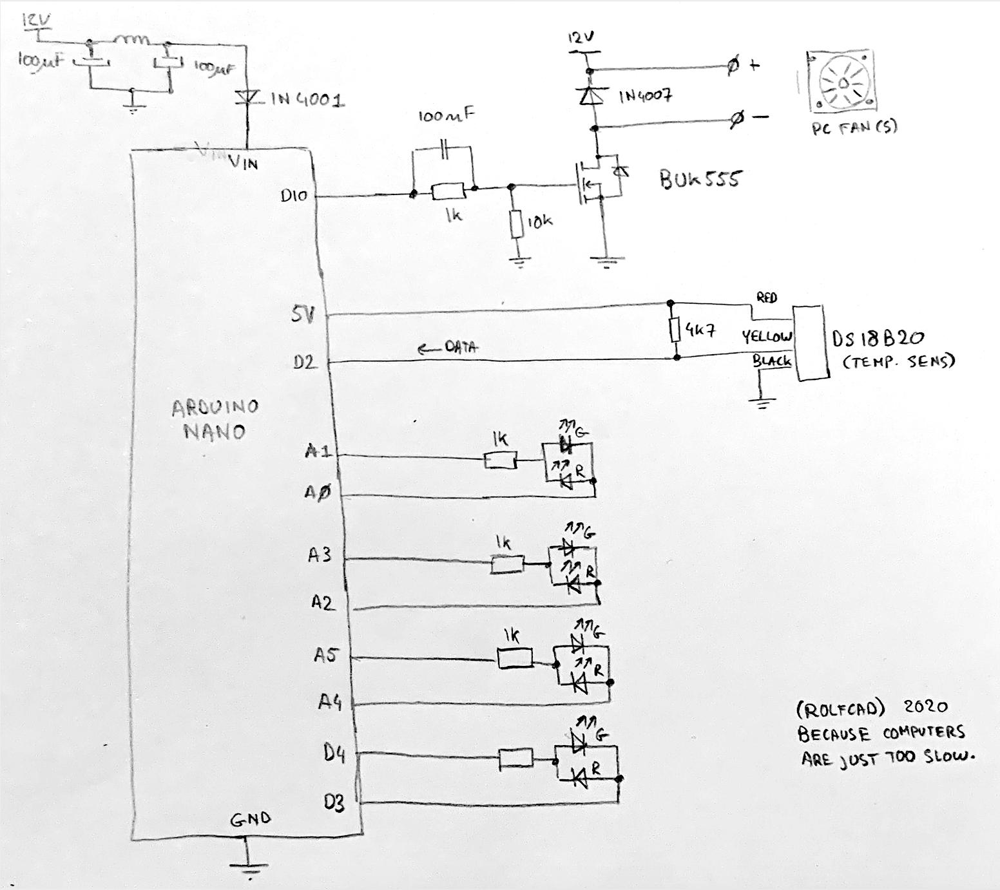

# Cheap Comfort

A project to add PC fans to your radiators to improve efficiency and comfort, very much like the ["speed comfort"](https://www.speedcomfort.nl/) product currently on the market.

Controls fans to blow air through a central heating radiator
depending on the temperature of the radiator. This allows the
radiator to heat up the room quicker and at a lower temperature,
resulting in more comfort and less heating costs.

Reads temperature from a DS18B20 OneWire temperature sensor on pin D10.
Outputs PWM signal for driving a FET which drives PC Fans. 
Shows temperature and fan speed on 8 LEDs

Schematic:

