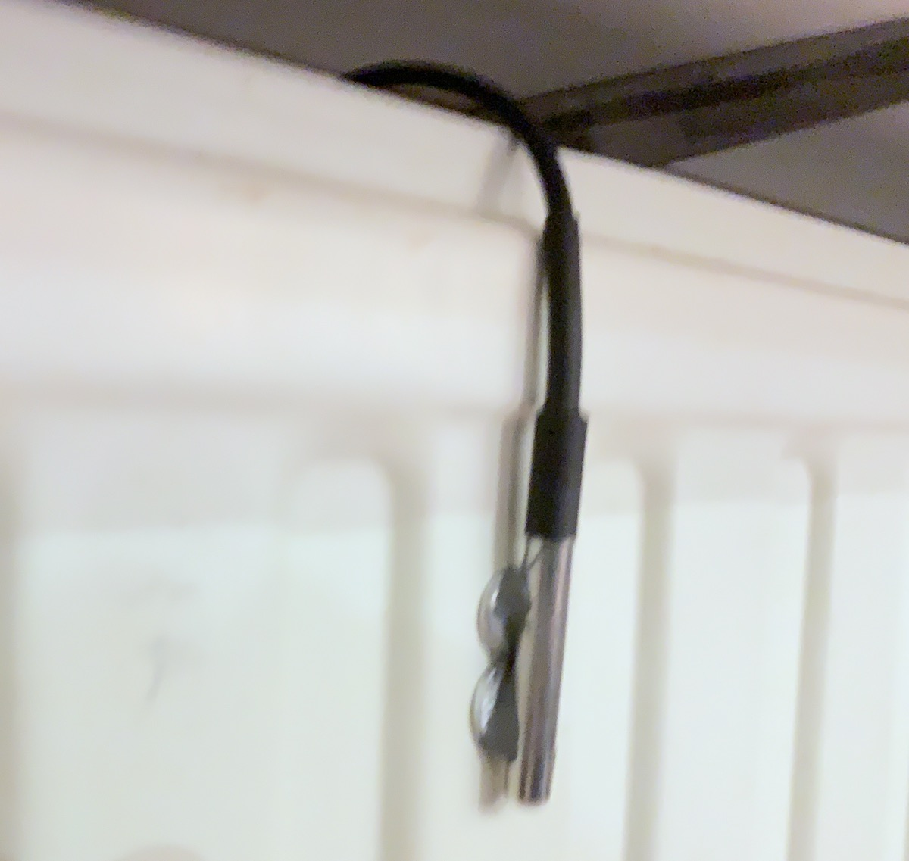

# Cheap Comfort

A project to add PC fans to your radiators to improve efficiency and comfort, very much like the ["speed comfort"](https://www.speedcomfort.nl/) product currently on the market.

Controls fans to blow air through a central heating radiator
depending on the temperature of the radiator. This allows the
radiator to heat up the room quicker and at a lower temperature,
resulting in more comfort and less heating costs.

Reads temperature from a DS18B20 OneWire temperature sensor on pin D10.
Outputs PWM signal for driving a FET which drives PC Fans. 
Shows temperature and fan speed on 8 LEDs

Schematic:

Mounting the fans between two pieces of wood:

Deadbug the arduino and BUK555:

Re-use of the two color SMD LEDs I found:

Glued magnets to the temperature sensor so that it can be easily mounted to the heater:

Everything in action. Here we see that the fans are at low speed (one red LED) and the temperature of the plates is above 30 degrees Celcius (last green led is on)

